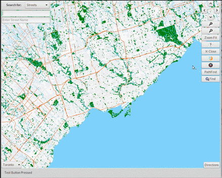
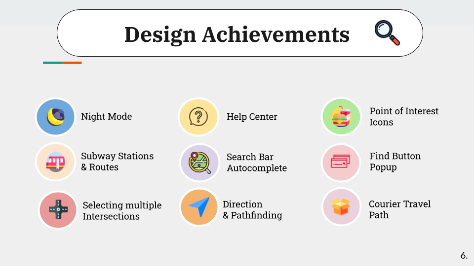

# MAPS-by-KNP

 <b>Developers:</b> Kevin Zeng, Nicholas Short and Paula Perdomo (hence KNP). 
<b>ECE297 Software, Communication & Design Final Course Project - 2021 Academic Year.</b>

 MAPS by KNP is a mapping software using OpenStreetMap open source code database API (OSM data), C++ programming language, GTK glade, and EZGL Graphics Library.  

 Source code CANNOT be provided as this is the final project of the University of Toronto's ECE297 course.  
For questions or insights on MAPS by KNP, please contact me. 

# Design Acheievements 

MAPS by KNP has the following features, enabling the user ease in navigation. 
 

# Functionalities 
